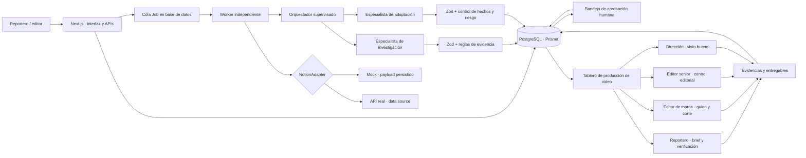
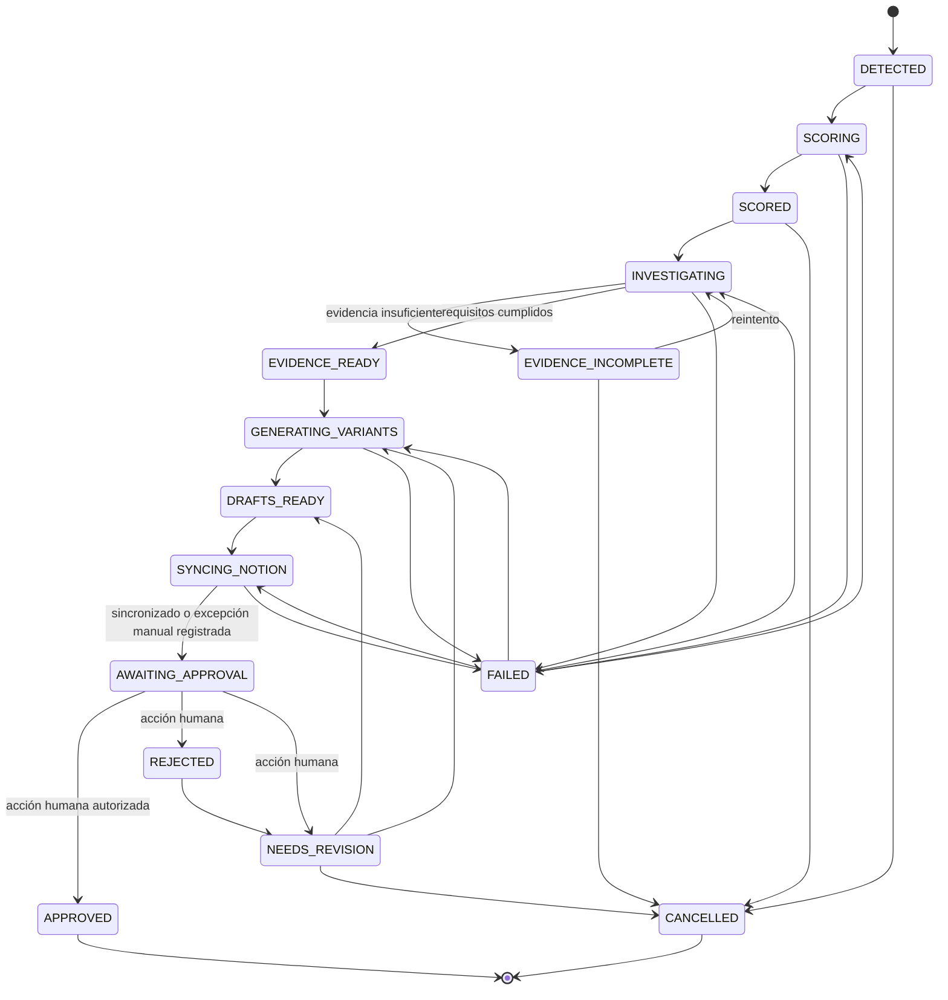

# Arquitectura

La puntuación, transición de estados, evidencia mínima, permisos y riesgo se deciden o validan mediante código determinista. El modelo no accede a credenciales ni ejecuta integraciones externas.

# Máquina de estados

`APPROVED` requiere una identidad interna y una autorización compatible con el riesgo. No existe `PUBLISHED`.

# Producción colaborativa de video

Cada `ContentVariant` puede tener un único `VideoProject`. El proyecto conserva participantes, ocho `VideoTask` ordenadas, `VideoEvidence` y `VideoComment`. El servidor valida quién puede actualizar cada tarea; los roles de editor senior, Dirección y administración pueden supervisar el trabajo, mientras que el rol asignado ejecuta su etapa.

El progreso se calcula únicamente a partir de tareas completadas. Un bloqueo lleva el proyecto a `BLOCKED`; al llegar a revisión editorial o de Dirección cambia a `IN_REVIEW`; solo las ocho tareas documentadas producen `READY`. No existe una transición automática desde `READY` hacia publicación.
